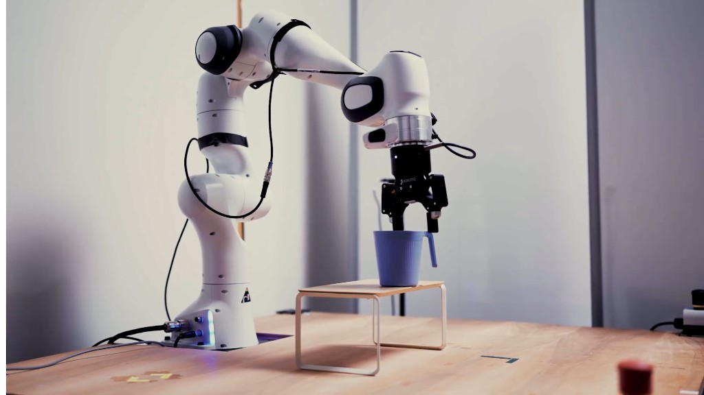
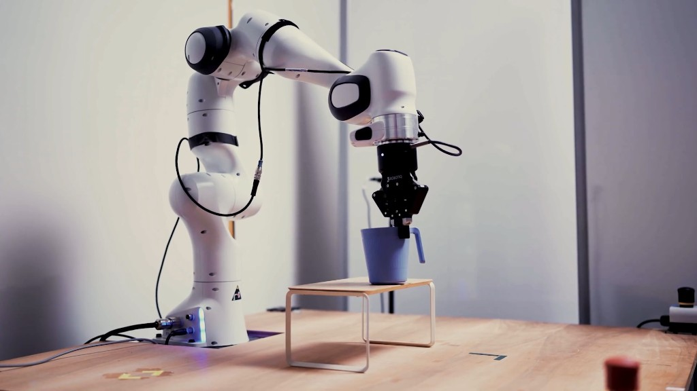
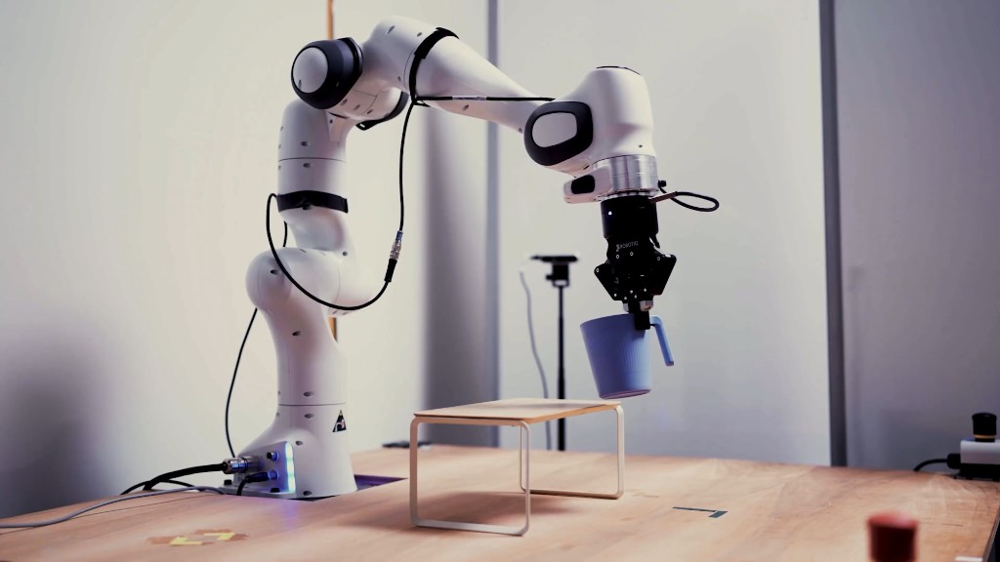
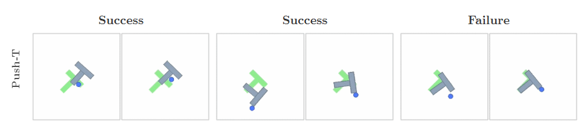
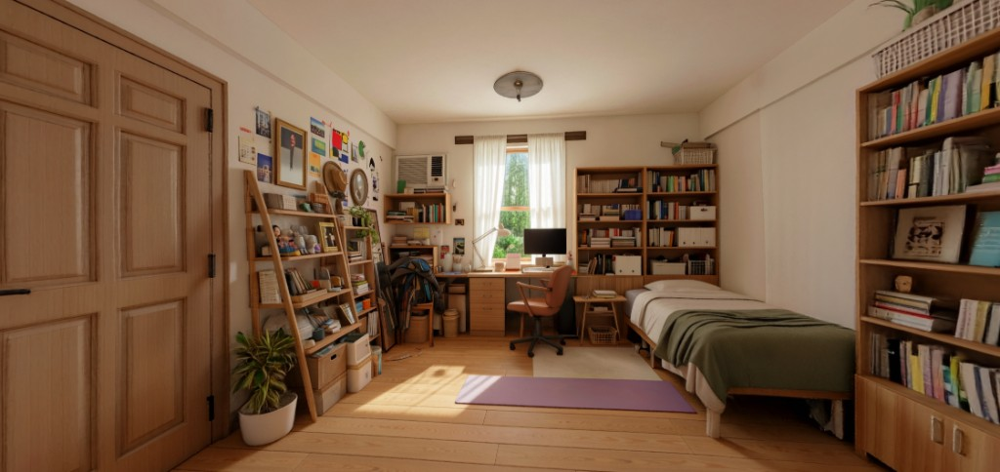
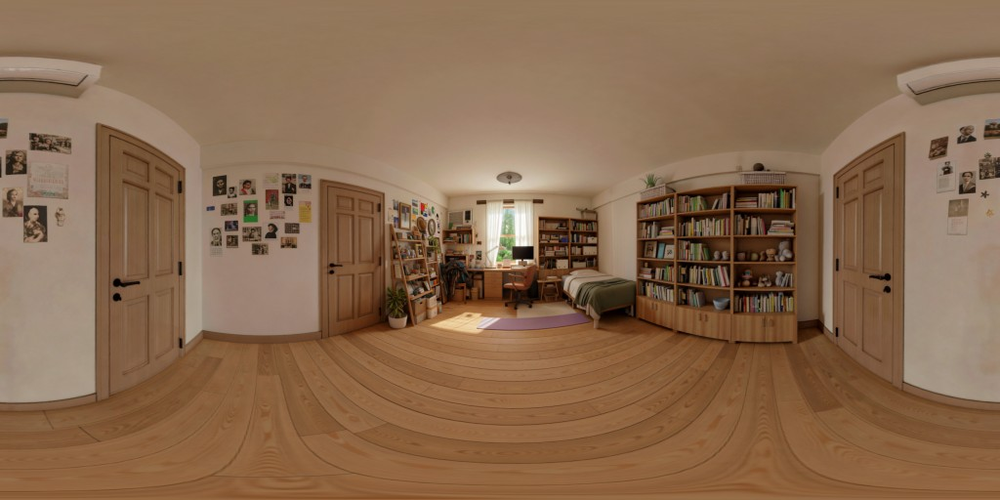

# Hands-On: Practical Access and Demos of World Models

> This page covers the **practical side** of world models: which models you can run, test, or watch in action today.
> For theory, architecture, and benchmarks, see the companion pages (Articles, Best Practices, Experiments, Costs).

---

## Access summary table

| Model | Organization | Access | Hardware | Main link |
|---|---|---|---|---|
| **V-JEPA 2 / 2.1** | Meta FAIR | Open (GitHub + HuggingFace + Colab) | CUDA GPU | [github.com/facebookresearch/vjepa2](https://github.com/facebookresearch/vjepa2) |
| **I-JEPA** | Meta FAIR | Open (GitHub + HuggingFace) | GPU (or CPU for inference) | [github.com/facebookresearch/ijepa](https://github.com/facebookresearch/ijepa) |
| **LeWorldModel** | MILA / NYU / Samsung SAIL | Open (GitHub) | Single GPU, trains in hours | [github.com/lucas-maes/le-wm](https://github.com/lucas-maes/le-wm) |
| **DreamerV3** | Danijar Hafner (DeepMind) | Open (GitHub, Nature 2025) | GPU (JAX) | [github.com/danijar/dreamerv3](https://github.com/danijar/dreamerv3) |
| **DreamerV4** | Community (PyTorch) | Open (GitHub + HF checkpoints) | Single 4090 (8 GB VRAM) | [github.com/Serenade-Intermezzo/dreamer-v4](https://github.com/Serenade-Intermezzo/dreamer-v4) |
| **NVIDIA Cosmos 3** | NVIDIA | Open (GitHub + HF + NIM) | RTX PRO 6000 (Nano) or Hopper (Super) | [github.com/nvidia/cosmos](https://github.com/nvidia/cosmos) |
| **NVIDIA Isaac Sim** | NVIDIA | Open (NGC container) | NVIDIA GPU | [developer.nvidia.com/isaac/sim](https://developer.nvidia.com/isaac/sim) |
| **World Labs Marble** | World Labs (Fei-Fei Li) | Public web app + API | Browser / API key | [marble.worldlabs.ai](https://marble.worldlabs.ai) |
| **Google Genie 3** | Google DeepMind | Restricted (AI Ultra $200/mo, US) | Google subscription | [deepmind.google/models/genie](https://deepmind.google/models/genie/) |
| **Wayve GAIA-2** | Wayve | Closed / Internal | N/A (videos only) | [wayve.ai/thinking/gaia-2](https://wayve.ai/thinking/gaia-2/) |
| **DreamDojo** | NVIDIA | Open (GitHub + HF) | GPU | [github.com/NVIDIA/DreamDojo](https://github.com/NVIDIA/DreamDojo) |
| **Kairos 3.0-4B** | ACE Robotics | Open (GitHub + HF) | Edge-friendly | [huggingface.co/kairos-agi](https://huggingface.co/kairos-agi/kairos-sensenova-robot) |

---

## Detailed guides

Each accessible model has its own page with installation, code, checkpoints, demos, and limitations.

| Model | Guide |
|---|---|
| V-JEPA 2 / 2.1 | [Open guide](hands-on/vjepa2.md) |
| I-JEPA | [Open guide](hands-on/ijepa.md) |
| LeWorldModel | [Open guide](hands-on/leworldmodel.md) |
| DreamerV3 | [Open guide](hands-on/dreamerv3.md) |
| DreamerV4 | [Open guide](hands-on/dreamerv4.md) |
| NVIDIA Cosmos 3 | [Open guide](hands-on/cosmos3.md) |
| NVIDIA Isaac Sim | [Open guide](hands-on/isaac-sim.md) |
| World Labs Marble | [Open guide](hands-on/marble.md) |

---

## Models with restricted access

### Google Genie 3 / Project Genie

Interactive 3D world generated from text, in real time. Grounded in Google Street View data.

**Who has access:** Google AI Ultra subscribers ($200/mo), 18+, initially the US (expanding globally in 2026).

**What it does:** generates worlds from text (720p, 24fps), real-time exploration, "promptable world events", Street View grounding.

**Current limitations:** sessions limited to ~60 seconds, not always photorealistic, character response can be slow.

**Demos:**

- Blog: [deepmind.google/blog/genie-3](https://deepmind.google/blog/genie-3-a-new-frontier-for-world-models/)
- Model: [deepmind.google/models/genie](https://deepmind.google/models/genie/)
- Used by **Waymo** for road simulation

### Wayve GAIA-2

Video-generative world model specific to autonomous driving. Generates multi-camera driving scenarios with fine-grained control over vehicle behavior, weather, agents, and road conditions.

**Who has access:** internal to Wayve (not publicly available).

**Coverage:** driving environments in the UK, US, and Germany.

**Demos:**

- Technical blog: [wayve.ai/thinking/gaia-2](https://wayve.ai/thinking/gaia-2/)
- Project page: [wayve.ai/science/gaia](https://wayve.ai/science/gaia/)
- Paper: [arxiv.org/html/2503.20523v1](https://arxiv.org/html/2503.20523v1)

---

## Video and demo gallery

### Robot planning

| What | Source | URL |
|---|---|---|
| V-JEPA 2, Franka pick-and-place (zero-shot) | Meta AI Blog | [ai.meta.com/blog/v-jepa-2](https://ai.meta.com/blog/v-jepa-2-world-model-benchmarks/) |
| V-JEPA 2, reaching and grasping | Meta Research | [ai.meta.com/research/vjepa](https://ai.meta.com/research/vjepa/) |
| LeWorldModel, Push-T and 3D | Project page | [le-wm.github.io](https://le-wm.github.io/) |
| HWM, hierarchical planning (0% to 70%) | Paper | [arxiv.org/abs/2604.03208](https://arxiv.org/abs/2604.03208) |
| GR00T N1.6, humanoid | NVIDIA Blog | [developer.nvidia.com](https://developer.nvidia.com/blog/building-generalist-humanoid-capabilities-with-nvidia-isaac-gr00t-n1-6-using-a-sim-to-real-workflow/) |

### Interactive demos

| What | Source | How to access |
|---|---|---|
| DreamerV4, play inside the world model | GitHub | Clone repo + download checkpoints |
| World Labs Marble, create 3D worlds | Web app | [marble.worldlabs.ai](https://marble.worldlabs.ai) (free) |
| Project Genie, real-time text-to-world | Google Labs | Google AI Ultra subscription |

### World generation and simulation

| What | Source | URL |
|---|---|---|
| NVIDIA Cosmos 3, video/action generation | NVIDIA Blog | [developer.nvidia.com](https://developer.nvidia.com/blog/develop-physical-ai-reasoning-world-and-action-models-with-nvidia-cosmos-3/) |
| Cosmos GTC keynote | YouTube | [youtube.com/watch?v=kChwwFb5gMU](https://www.youtube.com/watch?v=kChwwFb5gMU) |
| PointWorld, world model with 3D flows | YouTube | [youtu.be/XPOsCwrYdk0](https://youtu.be/XPOsCwrYdk0) |
| DreamDojo, egocentric simulation | Project page | [dreamdojo-world.github.io](https://dreamdojo-world.github.io/) |

### Autonomous driving

| What | Source | URL |
|---|---|---|
| Wayve GAIA-2, controllable scenarios | Wayve Blog | [wayve.ai/thinking/gaia-2](https://wayve.ai/thinking/gaia-2/) |
| Genie + Street View, real-world grounding | Google Blog | [blog.google](https://blog.google/innovation-and-ai/models-and-research/google-deepmind/project-genie-expands/) |

### Educational

| What | Source | URL |
|---|---|---|
| LeCun on H-JEPA (talk) | YouTube | [youtube.com/watch?v=EvSe0ktD95k](https://www.youtube.com/watch?v=EvSe0ktD95k) |
| "World Models, From Zero to Hero" | HackMD | [hackmd.io/@AbdelStark](https://hackmd.io/@AbdelStark/world-model-from-zero-to-hero) |
| LearnOpenCV V-JEPA 2 guide | Blog | [learnopencv.com](https://learnopencv.com/v-jepa-2-meta-world-model-robotics-guide/) |
| I-JEPA explained | Encord Blog | [encord.com/blog/i-jepa-explained](https://encord.com/blog/i-jepa-explained/) |

---

## Screenshots

**V-JEPA 2**, Franka performing zero-shot pick-and-place (real sequence):

  

**LeWorldModel**, Push-T (success and failure in the 2D environment):

**World Labs Marble**, a room generated in 3D from an image:

 

---

## How to choose what to test

| Your goal | Recommended model | Why |
|---|---|---|
| Understand JEPA in practice | **I-JEPA** (HuggingFace) | 5 lines of code, runs on CPU |
| Train a complete world model | **LeWorldModel** | Single GPU, a few hours, full pipeline |
| Watch robot planning | **V-JEPA 2** blog demos | Most impressive results, well-documented videos |
| Run robot planning code | **V-JEPA 2** (Colab/local) | Official notebook; AC requires DROID data |
| Play inside a world model | **DreamerV4** | Real time with a joystick, 4090 GPU |
| Train an RL agent in imagination | **DreamerV3** | Mature codebase (Atari, Crafter, Minecraft) |
| Generate 3D worlds (no code) | **World Labs Marble** | Free web app, no GPU |
| Full Physical AI pipeline | **NVIDIA Cosmos 3 + Isaac Sim** | Complete stack: generation, reasoning, simulation |

---

## Industrial deployments (observable, not testable)

Real deployments using world models or Physical AI at scale:

| Company | What | Context |
|---|---|---|
| **Tesla** | Optimus Gen 3 (1,000+ units in factories) | Foxconn (+73% efficiency) |
| **Xiaomi** | Humanoids on the EV assembly line (90.2% success) | [News](https://machineherald.io/article/2026-03/03-xiaomi-deploys-humanoid-robots-on-its-ev-assembly-line) |
| **BMW** | Physical AI at iFactory Leipzig (Figure AI) | [News](https://newmobility.news/en/2026/03/02/bmw-introduces-physical-ai-in-its-ifactory/) |
| **Waymo** | Uses Genie for road simulation | Connected to Project Genie / Street View |
| **1X, Agility, XPENG, Uber, Waabi** | Use NVIDIA Cosmos for sim-to-real training | Cosmos ecosystem |
| **Siemens** | Digital twins (-20% maintenance, +15% uptime) | Industrial IoT |
| **Universal Robots** | AI Cobots with Isaac + Jetson | [Case study](https://www.nvidia.com/en-us/customer-stories/universal-robots-accelerates-cobot-development-with-nvidia/) |

---

## Key references

- V-JEPA 2: [arxiv.org/abs/2506.09985](https://arxiv.org/abs/2506.09985)
- LeWorldModel: [arxiv.org/abs/2603.19312](https://arxiv.org/abs/2603.19312)
- DreamerV3 (Nature): [nature.com/articles/s41586-025-08744-2](https://www.nature.com/articles/s41586-025-08744-2)
- DreamerV4: [arxiv.org/abs/2509.24527](https://arxiv.org/abs/2509.24527)
- NVIDIA Cosmos 3: [Technical Report](https://research.nvidia.com/labs/cosmos-lab/cosmos3/technical-report.pdf)
- HWM: [arxiv.org/abs/2604.03208](https://arxiv.org/abs/2604.03208)
- "World Models, Zero to Hero": [hackmd.io/@AbdelStark](https://hackmd.io/@AbdelStark/world-model-from-zero-to-hero)
