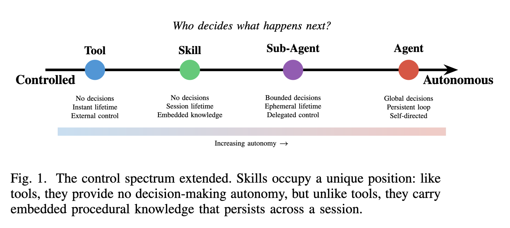
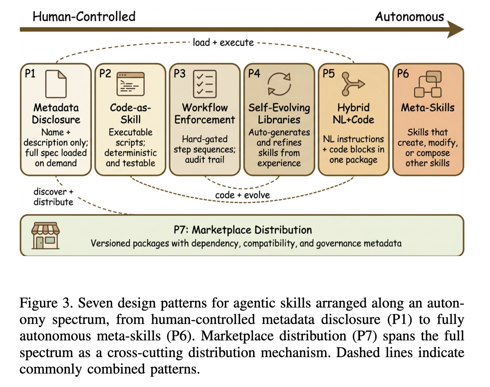
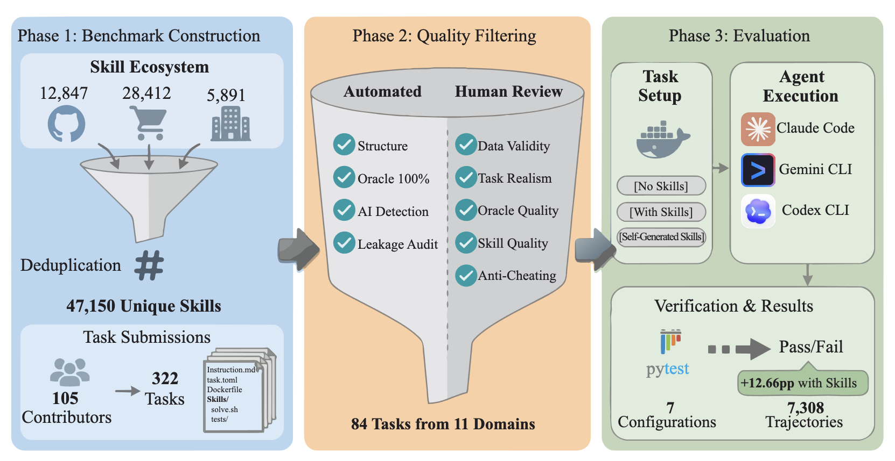
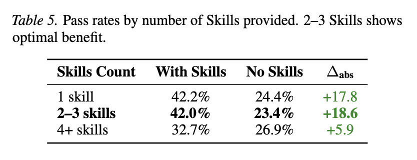
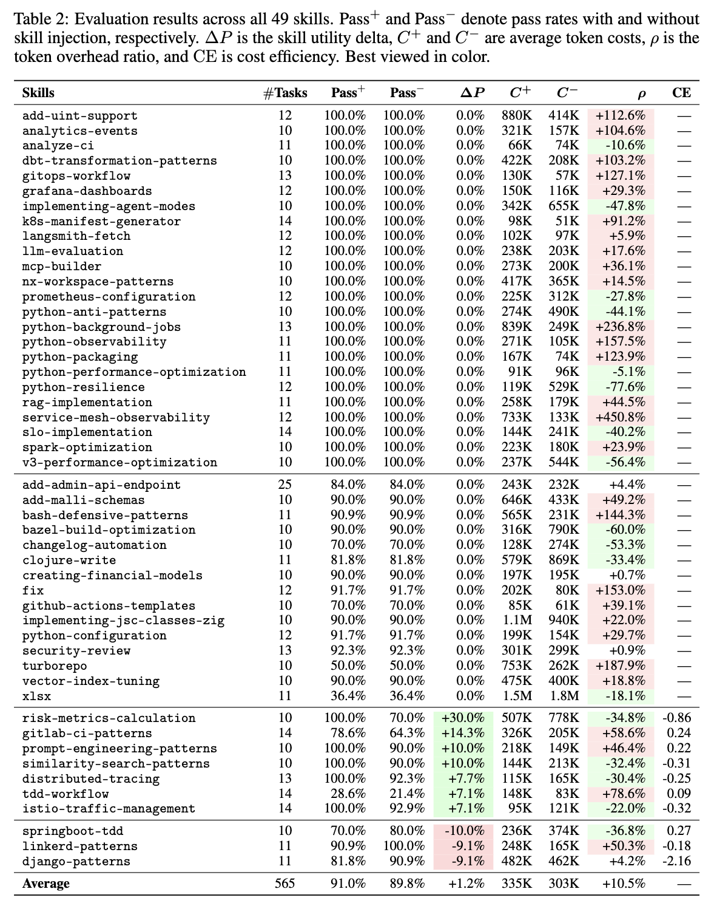

# Articles - Skills

### Agent, Sub-Agent, Skill, or Tool? A Practitioner’s Guide to Extending Agentic AI Systems

[taxonomy.pdf](articles-skills/taxonomy.pdf)

- **Control Axis:** Argues that the fundamental design decision for AI systems should be based on **control over execution** rather than the "intelligence" of the module.
- **Taxonomy Definitions:**
    - **Tool:** Capability without decision-making.
    - **Skill:** Procedural knowledge without decision-making.
    - **Sub-Agent:** Delegated reasoning/cognition.
    - **Agent:** Full autonomous control of the goal and lifecycle.
- **Context Efficiency:** Demonstrates that "Progressive Disclosure" of skills can reduce token consumption by up to **96%** compared to static tool loading.
- **Multi-Agent Pitfalls:** Highlights that multi-agent coordination can actually **degrade performance by 39–70%** in sequential tasks due to communication errors.
- **Decision Framework:** Provides a guide for practitioners to choose the right construct, prioritizing simpler designs (Tools/Skills) before moving to high-autonomy Agents.
- **Conclusion:** Autonomy should be **"earned through necessity"**; practitioners should maximize auditability and efficiency by choosing the least autonomous construct that fits the task.

### SoK: Agentic Skills - Beyond Tool Use in LLM Agents

[SoK.pdf](articles-skills/sok.pdf)

- **Unification Concept:** Proposes a formalization of agentic skills as reusable modules of **procedural memory**, distinct from atomic tool calls or one-off plans.
- **Formal Structure:** Defines a skill as a tuple $S = (C, \pi, T, R)$, consisting of applicability conditions, execution policies, termination criteria, and reusable interfaces.
- **The Lifecycle:** Maps the entire journey of a skill from discovery and practice to distillation, storage, composition, and autonomous updates.
- **Design Patterns:** Identifies 7 system-level design patterns, including "Progressive Disclosure" (loading only what is needed) and "Self-Evolving Libraries."
- **Taxonomy of Scope:** Classifies skills based on their representation (Natural Language vs. Code) and the environment they operate in (Web, OS, Robotics, etc.).
- **Conclusion:** The reliability of autonomous agents depends on moving from ad-hoc planning to a structured "skill layer" that is verifiable and certifiable.

### SkillsBench

[benchmark-1.pdf](articles-skills/benchmark-1.pdf)

- **The Framework:** Introduces **SKILLSBENCH**, a benchmark of 84 tasks across 11 domains designed to measure if procedural knowledge packages actually improve agent performance.
- **Skill Definition:** Defines skills as structured packages of procedural knowledge injected at inference time to guide agent behavior without retraining the model.
- **Efficacy Results:** Human-curated skills improved the average success rate by **16.2 percentage points (pp)**, with dramatic gains in specialized fields like Healthcare (+51.9pp).
- **Self-Generation Failure:** Skills generated by the AI models themselves (without human curation) provided **no benefit** on average and often degraded performance.
- **Principle of Focus:** The study found that "less is more"; focused skills with only **2–3 modules** outperformed long, exhaustive documentations that caused cognitive overhead.
- **Conclusion:** Skills can compensate for model scale, allowing smaller models with the right instructions to match or exceed the performance of larger models.

### SWE-Skills-Bench

[benchmark-2-software.pdf](articles-skills/benchmark-2-software.pdf)

- **Practical Focus:** This is the first requirement-driven benchmark to isolate the marginal utility of skills in authentic Software Engineering (SWE) tasks using GitHub repositories.
- **Limited Impact:** Contrary to high industry expectations, **39 of the 49 skills (80%)** evaluated resulted in zero improvement in task success rates.
- **Low Average Gains:** The overall average improvement in pass rates was only **+1.2%**, indicating that the utility of general SWE skills is narrower than previously thought.
- **Specialized Success:** Only a small subset of skills focused on very specific procedures (e.g., cloud traffic patterns or risk formulas) showed meaningful gains (up to +30%).
- **Interference Risks:** Some skills actually **degraded performance** (by up to -10%) by introducing patterns that conflicted with the specific project context.
- **Conclusion:** In software engineering, skills are "niche interventions"; their success depends entirely on exact domain fit and avoiding conflict with the existing codebase.

### Exploring Emerging Threats of the Agent Skill Ecosystem

[skills-report.pdf](articles-skills/skills-report.pdf)

- **Concept:** This report analyzes the security landscape of AI agent "skills" (packaged instructions and code) across major marketplaces like Claw Hub.
- **Threat Taxonomy:** It identifies 8 security threat categories, including critical-level issues such as prompt injection, malicious code execution, and suspicious downloads.
- **Natural Language Malware:** The authors highlight that prompt injections now allow for "malware" created entirely with natural language, significantly lowering the barrier for attackers.
- **Security Findings:** Of 3,984 analyzed skills, **13.4%** contained at least one critical security issue, with 76 confirmed malicious payloads (e.g., credential theft and backdoors).
- **Attack Patterns:** In confirmed malicious skills, **100%** contained malicious code and **91%** employed prompt injection techniques to compromise the agent.
- **Conclusion:** As agents gain access to sensitive credentials, automated security analysis is no longer optional; manual review cannot scale with the rapid growth of the skill ecosystem.
