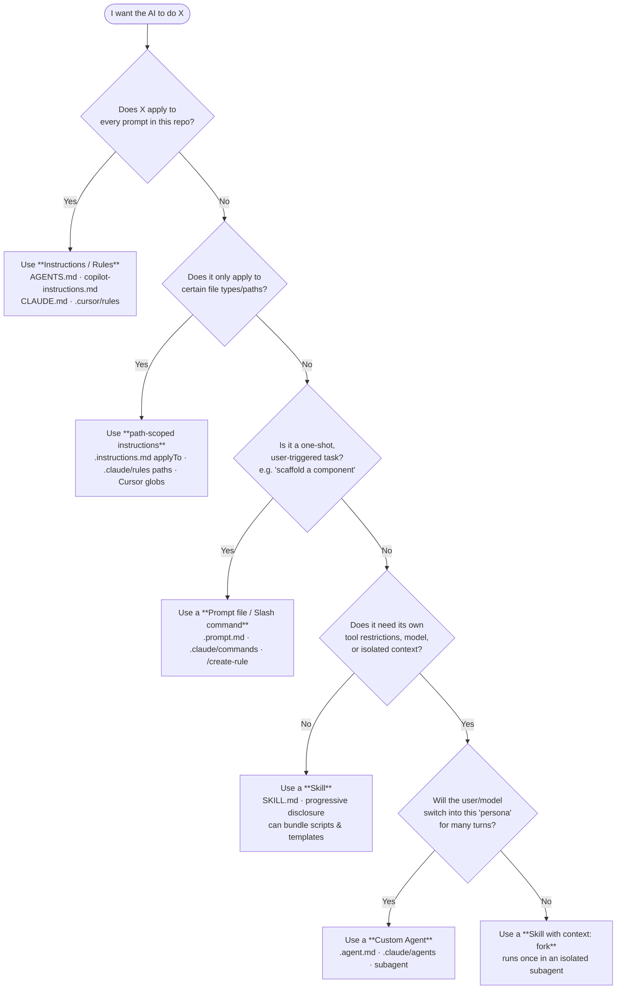
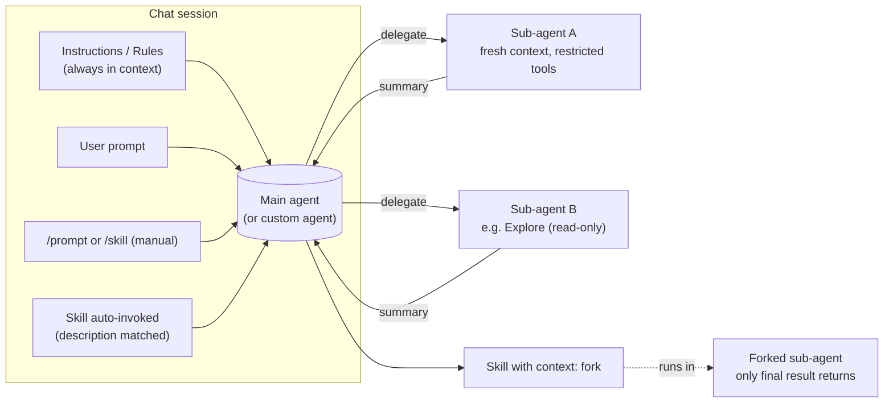
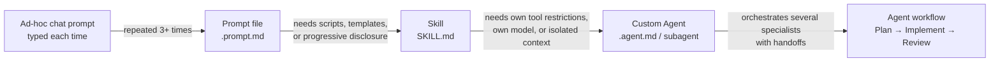

# Multi-platform AI Coding Primitives Guidelines

# AI Coding Primitives: Agents, Skills, Instructions, and Prompts

A practical, vendor-spanning guide for engineering teams adopting AI coding
tools. Explains what each primitive is, when to use it, when **not** to use it,
how they compose, and what changes when you “graduate” from a Skill to an
Agent.

> Scope: Anthropic Claude / Claude Code, OpenAI Codex/ChatGPT, Google Gemini /
Gemini Code Assist, GitHub Copilot (VS Code), and Cursor.
Last updated: 2026-05-22.
> 

---

## 1. TL;DR: The four primitives

| Primitive | What it is | Loaded… | Invoked by | Owns its context? | Owns tools? |
| --- | --- | --- | --- | --- | --- |
| **Custom Agent** (persona / sub-agent / chat mode) | A reusable persona with its own system prompt, tool list, model, and (often) its own context window | At session/agent start | User selects it, or another agent delegates | **Yes**: usually a fresh, isolated context window | **Yes**: explicit allow/deny lists |
| **Skill** (Agent Skill / `SKILL.md`) | A folder of instructions + optional scripts/templates the model loads **on demand** when a task matches its description | **Progressively**: name+description always visible, body loaded when relevant or via `/skill-name` | Model (auto) or user (`/skill-name`) | Runs inline in the main context (can opt into a forked sub-agent) | Can pre-approve tools, but does not restrict |
| **Instructions / Rules** (`AGENTS.md`, `CLAUDE.md`, `copilot-instructions.md`, `.instructions.md`, `.cursor/rules`) | Always-on or path-scoped guidance about *how* to write code in this repo | **Every request** (or every request that touches a matching path) | Implicit, added to every prompt automatically | No, they live in the main context | No |
| **Prompt / Command** (`.prompt.md`, slash commands, “custom commands”) | A canned, single-shot prompt the user fires manually | Only when invoked | User typing `/command` | No, runs in current chat | Can specify per-prompt tool set |

A one-line mental model:

- **Instructions** = *standing orders* (always in the room).
- **Skills** = *playbooks on the shelf* (pulled down when the situation matches).
- **Prompts** = *macros* (you press the button; one shot).
- **Agents** = *colleagues* (their own desk, their own toolbox, their own brief).

---

## 2. Decision diagram: which primitive should I reach for?



---

## 3. Vendor-by-vendor map

The same four primitives exist almost everywhere, but the names and file
formats differ. This table is the Rosetta Stone.

| Concept | Anthropic Claude Code | OpenAI Codex / ChatGPT | Google Gemini | GitHub Copilot (VS Code) | Cursor |
| --- | --- | --- | --- | --- | --- |
| Always-on repo instructions | [`CLAUDE.md`](https://code.claude.com/docs/en/memory) (project / user / managed) | [`AGENTS.md`](https://developers.openai.com/codex/cloud/agents-md) (nested, nearest wins) | `.gemini/styleguide.md`, system instructions | `.github/copilot-instructions.md`, `AGENTS.md`, `CLAUDE.md` | `.cursor/rules` with `alwaysApply: true`, `AGENTS.md` |
| Path-scoped rules | [`.claude/rules/*.md`](https://code.claude.com/docs/en/memory) with `paths:` frontmatter | (AGENTS.md scoped by directory tree) | `.gemini/config.yaml` `ignore_patterns` | [`.instructions.md`](https://code.visualstudio.com/docs/copilot/customization/custom-instructions) with `applyTo:` glob | `.mdc` rules with `globs:` frontmatter |
| Skills (progressive-disclosure capabilities) | [`SKILL.md`](https://code.claude.com/docs/en/skills) in `.claude/skills/` (Anthropic invented this term) | Agent Skills via [open standard](https://agentskills.io/) |, (no native equivalent yet) | [Agent Skills](https://code.visualstudio.com/docs/copilot/customization/agent-skills) in `.github/skills/` / `.claude/skills/` |, (closest analog: project rules) |
| Prompts / slash commands | [Skills](https://code.claude.com/docs/en/skills) (commands have merged into skills); legacy `.claude/commands/*.md` | (no first-class equivalent) | n/a | [`.prompt.md`](https://code.visualstudio.com/docs/copilot/customization/prompt-files) in `.github/prompts/` | `/create-rule` etc. (built-ins) |
| Custom agents (personas / sub-agents) | [`.claude/agents/*.md`](https://code.claude.com/docs/en/sub-agents) (subagents); built-ins: Explore, Plan, general-purpose | “Custom GPTs” / Codex agents (cloud) | Gemini Code Assist [Agent mode](https://developers.google.com/gemini-code-assist/docs/agent-mode) | [`.agent.md`](https://code.visualstudio.com/docs/copilot/customization/custom-agents) in `.github/agents/` or `.claude/agents/` | Cursor Agent (single built-in agent, configured via rules) |

> **Note:** Open standards are starting to converge.
- [`AGENTS.md`](https://github.com/agentsmd/agents.md) is supported by OpenAI Codex, GitHub Copilot, Cursor, and Gemini CLI.
- [`agentskills.io`](https://agentskills.io/) is the open Skill standard, implemented by Anthropic and Microsoft.
- VS Code can load `.claude/agents/`, `.claude/skills/`, `.claude/rules/`, and `CLAUDE.md` natively for cross-tool reuse.
> 

---

## 4. Primitive deep-dives

### 4.1 Instructions / Rules

**Definition.** Markdown that is concatenated into the prompt for *every*
request (or every request that touches a matching path). They shape *how* the
AI works, not *what* it does.

**Where they live (by vendor).** See the table in §3.

**Priority order** (consistent across vendors, roughly):

1. Managed / organization policy (highest)
2. User / personal
3. Repository / project root
4. Nested / path-scoped (most specific wins for that path)

**Do**

- Write **specific, verifiable** rules: *“Use 2-space indentation”* beats
*“format code nicely”* ([Claude memory docs](https://code.claude.com/docs/en/memory#write-effective-instructions)).
- Keep each file **short**: Claude recommends < 200 lines; VS Code recommends
splitting into multiple `.instructions.md` files.
- Include the **reason** behind rules so the model handles edge cases
(“use `date-fns` because `moment.js` is deprecated”).
- Use **path scoping** (`applyTo`, `paths`, `globs`) to keep noise out of
unrelated tasks.
- Check them into version control so the whole team and CI agents benefit.

**Don’t**

- Don’t paste an entire style guide, that’s what linters/formatters are for ([Cursor best practices](https://cursor.com/docs/rules#what-to-avoid-in-rules)).
- Don’t add contradictory rules across files, the model picks one
arbitrarily.
- Don’t put **task procedures** in instructions. If a section reads like
*“steps to deploy”*, it should be a **Skill** or **Prompt**, not standing
orders. Instructions are facts; skills are procedures ([Claude guidance](https://code.claude.com/docs/en/memory#when-to-add-to-claudemd)).
- Don’t rely on instructions for **enforcement**. They are context, not
policy. Use hooks, permissions, or CI for hard constraints ([Claude](https://code.claude.com/docs/en/memory#claude-isn-t-following-my-claudemd)).
- Don’t duplicate `AGENTS.md` / `CLAUDE.md` / `copilot-instructions.md`, pick
one and have the others `@import` or symlink it.

---

### 4.2 Prompts / Slash commands

**Definition.** A canned, parameterized prompt the user invokes manually with
`/name`. Single-shot. Optionally specifies an agent, model, and tool list for
that one execution.

**Where they live.**

- VS Code: [`.github/prompts/*.prompt.md`](https://code.visualstudio.com/docs/copilot/customization/prompt-files)
- Claude Code: [Skills](https://code.claude.com/docs/en/skills) (commands have been merged into skills); legacy `.claude/commands/*.md` still works.

**Do**

- Use for **lightweight, repeatable tasks**: “scaffold a React form”,
“summarize uncommitted changes”, “generate a PR description”.
- Parameterize with `${input:name}` (VS Code) or `$ARGUMENTS` / `$0` / `$1`
(Claude).
- Pre-bind a tool list when the task needs specific tools.
- Reference instructions files with Markdown links instead of repeating
conventions.

**Don’t**

- Don’t use for tasks the model should **discover on its own**: use a Skill
(with a good `description`) instead.
- Don’t build a multi-persona workflow as a prompt. Use **handoffs between
agents** (VS Code custom agents) or **chained sub-agents** (Claude).
- Don’t put one-off explorations in a prompt file, keep prompt files for
things you’ll run **5+ times**.

---

### 4.3 Skills

**Definition.** A folder containing `SKILL.md` (instructions + YAML
frontmatter) plus optional templates, scripts, and reference docs. The model
sees only the **name and description** by default; the **body loads only when
the skill is invoked**, automatically (description matches the task) or
manually (`/skill-name`). This is called **progressive disclosure** and is the
key efficiency win over Instructions.

Defined by the [Agent Skills open standard](https://agentskills.io/) (Anthropic
+ Microsoft). Portable across Claude Code, GitHub Copilot, Copilot CLI, and
Copilot cloud agent.

**Anatomy** ([reference](https://code.claude.com/docs/en/skills#frontmatter-reference)):

```yaml
---
name: api-conventions          # lowercase-hyphens, must match folder name
description: API design patterns for this codebase. Use when writing endpoints.
allowed-tools: Read Grep        # pre-approve tools (no permission prompts)
disable-model-invocation:false # set true for side-effect commands like /deploy
context: inline                 # or 'fork' to run in an isolated subagent
paths:["src/api/**/*.ts"]      # auto-load only for matching files
---

When writing API endpoints…
- Use RESTful naming
- Return consistent error formats
```

**Three-level loading** ([VS Code docs](https://code.visualstudio.com/docs/copilot/customization/agent-skills#how-copilot-uses-skills)):

1. **Discovery**: only the YAML `name` + `description` is in context.
2. **Instructions**: full `SKILL.md` body loads when invoked.
3. **Resources**: supporting files (`reference.md`, `scripts/*.py`) load only
when referenced.

**Do**

- Create a Skill when the same multi-step procedure shows up repeatedly, or
when a section of `CLAUDE.md` / `copilot-instructions.md` has grown into a
procedure rather than a fact.
- Write the `description` for the **invocation decision**: include the
trigger phrases users would actually say.
- Bundle **executable scripts** when traditional code is more reliable than
token generation (Anthropic explicitly calls this out, see the
[codebase-visualizer example](https://code.claude.com/docs/en/skills#generate-visual-output)).
- Keep `SKILL.md` **under 500 lines**: push detail into separate files
referenced from the body.
- Add `disable-model-invocation: true` for actions with **side effects**
(`/deploy`, `/commit`, `/send-slack-message`).
- Use `context: fork` for skills that read many files and only return a
summary, keeps the main context clean.

**Don’t**

- Don’t make a Skill for something that applies to every prompt, that’s an
**Instruction**.
- Don’t dump a giant runbook into `SKILL.md` body; once invoked, the body
stays in context across turns ([Claude lifecycle](https://code.claude.com/docs/en/skills#skill-content-lifecycle)).
- Don’t use vague descriptions like *“Helps with code”*, the model can’t
match them; the
[skill listing has a 1,536-char cap per entry](https://code.claude.com/docs/en/skills#frontmatter-reference).
- Don’t grant broad `allowed-tools` without thinking, a skill checked into a
repo can grant itself tool access once the workspace is trusted.
- Don’t keep a huge library of skills for similar use cases, it occupies context space and may harm the invocation process (i.e. when and which one will be invoked).

---

### 4.4 Custom Agents / Sub-agents

**Definition.** A reusable persona with its own system prompt, tool
allow/deny list, model choice, permission mode, and (critically) **its own
isolated context window**. Invoked by the user (chat mode picker, `@-mention`,
`--agent` flag) or delegated to by another agent.

> **Naming note.** VS Code “custom agents” were previously called “custom chat
modes” and use `.agent.md` ([docs](https://code.visualstudio.com/docs/copilot/customization/custom-agents#are-custom-agents-different-from-chat-modes)).
Anthropic calls them “subagents”. OpenAI/Cursor blur the line, their
top-level “Agent” is one configurable thing, and personas come from rules.
> 

**What an agent owns that a skill doesn’t:**

| Capability | Skill | Custom Agent |
| --- | --- | --- |
| Own system prompt | partial (body) | **yes** (replaces default) |
| Own tool list (allow/deny) | pre-approve only | **yes, restrictive** |
| Own model | per-skill override | **yes** (e.g. Haiku for speed) |
| Own context window | inline (or `fork`) | **yes, fresh by default** |
| Own permission mode | no | **yes** (`plan`, `acceptEdits`, etc.) |
| Persistent memory across sessions | no | **yes** (Claude `memory: user\|project\|local`) |
| Hooks scoped to it | no | **yes** |
| Handoffs to other agents | no | **yes** (VS Code) |
| Spawn sub-agents | no | **yes** (when running as main thread) |

**Do**

- Use an agent when you want **persistent persona** behavior across many turns
(planner, security reviewer, debugger, data scientist).
- **Restrict tools by default**: a code-reviewer agent should have
`Read, Grep, Glob, Bash` and nothing that can write.
- Pick a **smaller model** (Haiku, GPT-5-mini) for high-volume, read-only
agents, Claude’s built-in `Explore` agent does this.
- Use **handoffs** (VS Code) or **chains** (Claude) to compose workflows:
Plan → Implement → Review.
- Delegate **high-volume, low-signal** work (running the test suite, reading
big logs) to a sub-agent so the verbose output stays out of your main
context ([pattern](https://code.claude.com/docs/en/sub-agents#isolate-high-volume-operations)).
- Write a sharp `description` field, sub-agent delegation is description-driven.

**Don’t**

- Don’t reach for an agent when a skill or prompt would do (see §5).
- Don’t grant `bypassPermissions` casually, it skips approval for writes to
`.git`, `.claude`, `.vscode`, and friends ([warning](https://code.claude.com/docs/en/sub-agents#permission-modes)).
- Don’t expect a sub-agent to see your conversation history. By default
it starts with a **fresh context**: only the delegation message,
`CLAUDE.md` / `AGENTS.md`, and preloaded skills reach it.
- Don’t try to chain sub-agents from a sub-agent, they can’t spawn each
other in Claude. Use the main conversation to orchestrate.
- Don’t ignore the **prompt-cache cost**: every named sub-agent has its own
cache. Use *forks* (inheriting context) when you want cache reuse.

---

## 5. The composition picture



Key takeaway: **Instructions, Skills, and Prompts all run inside whatever agent
is active.** Custom Agents change *which* agent is active and *what context it
has*.

---

## 6. Promotion ladder: when to graduate

A repeatable rule of thumb based on Anthropic’s, Microsoft’s, and Cursor’s
guidance:



**Triggers to move up a level:**

| From → To | Move when… |
| --- | --- |
| Prompt → Skill | You need bundled scripts/templates, or you want the model to **auto-invoke** based on context, not just user typing `/`. |
| Skill → Custom Agent | You need **tool restrictions** (skills can pre-approve, not restrict), a **different model**, a **persistent persona** across many turns, or **persistent cross-session memory**. |
| Skill → Skill-with-`context: fork` | You need isolation for a single shot but don’t need a reusable persona. Cheaper than a named sub-agent for one-off isolation. |
| Custom Agent → multi-agent workflow | You repeatedly chain the same agents, define **handoffs** so the workflow is one click instead of one prompt per stage. |

---

## 7. Skill → Agent migration: do’s, don’ts, and warnings

This is the most common “graduation” and the easiest to get wrong.

### When a Skill is enough (don’t promote)

- The work is **one self-contained procedure** (“summarize this PR”).
- You’re happy with the parent’s tool set.
- You don’t need to **block** the model from using certain tools, you only
want to pre-approve some.
- The skill body is **< 500 lines** of standing instructions.

### When you actually need an Agent

- You need to **deny** specific tools (skills can’t deny, they can only
pre-approve).
- You want a **dedicated model** (e.g. Haiku for fast read-only work) that
persists across the whole conversation, not just one turn.
- You need **persistent memory across sessions** (`memory: user|project|local`
in Claude).
- You want the persona to be **selectable from a picker** and survive across
many follow-up turns.
- You want **handoffs** to another persona (VS Code).
- You want this work to happen in a **fresh context** every time it runs,
even when called from different parents.

### Do’s

- **Copy the skill body into the agent’s system prompt** (the markdown body
of the `.agent.md` / sub-agent file). The body **replaces** the default
system prompt for sub-agents.
- **Re-declare tools explicitly** with allow/deny lists. Sub-agents inherit
all tools by default, that’s usually too broad.
- **Add a sharp `description`**: sub-agent delegation is description-driven.
Include “use proactively” for agents you want auto-invoked.
- **Pick a model deliberately.** Read-only research → Haiku/mini.
Implementation → Sonnet/Sonnet-class. Don’t default to the most expensive.
- **Restate must-have rules** in the agent body. Sub-agents do load
`CLAUDE.md` / `AGENTS.md`, but the built-in Explore/Plan agents
[skip them](https://code.claude.com/docs/en/sub-agents#what-loads-at-startup),
and you may want the same isolation for your own.
- **Pre-load relevant skills** into the agent (Claude `skills:` field,
VS Code agent body referencing skills), gives it domain knowledge without
needing to discover skills mid-task.

### Don’ts

- Don’t **expect conversation history** to follow. A sub-agent starts
fresh. Either restate context in the delegation prompt or use a
**fork** instead of a named sub-agent.
- Don’t promote a skill with **side effects** (deploys, commits,
irreversible writes) to an auto-invocable agent. If you do, mark it
user-invocable only (`user-invocable: false` is the opposite, that
hides from the picker. Use `disable-model-invocation: true` on the skill
layer, and on the agent layer set conservative `permissionMode`).
- Don’t **chain sub-agents from a sub-agent**: they can’t spawn other
sub-agents in Claude. Chain from the main conversation, or convert the
workflow to skills.
- Don’t grant `bypassPermissions` or `acceptEdits` “to make things easier”.
A parent in `bypassPermissions` mode forces the same on all children
([docs](https://code.claude.com/docs/en/sub-agents#permission-modes)).
- Don’t forget to **update the picker UX**. A user-facing custom agent
needs a clear `name`, `description`, and `argument-hint` or your team won’t
discover it.

### Warnings before you ship a new custom agent to your repo

1. **Tool surface review.** Read `tools:` line by line. The default is
“inherit everything”, including MCP servers. Strip what isn’t needed.
2. **Permission mode review.** Anything stronger than `default` should require
a code-review sign-off, especially `acceptEdits` and `bypassPermissions`.
3. **Cost review.** A named sub-agent runs in its own context window with its
own prompt cache. Spawning many in parallel multiplies token usage.
4. **Loss of context.** Anything the user said five turns ago does **not**
reach a fresh sub-agent. If the work needs that context, use a *fork* or
stay in the main conversation.
5. **Branding/identity drift.** Custom agents that override the system prompt
can drop important safety/quality guidance from the default. Re-add the
rules you rely on (citation style, refusal behavior, etc.).
6. **Discoverability collision.** Two agents (or two skills) with the same
`name` across scopes silently override each other. Enterprise > personal >
project for Claude; check the diagnostics view in VS Code.

---

## 8. Common Anti-patterns

| Anti-pattern | Why it hurts | Do this instead |
| --- | --- | --- |
| Putting a 600-line runbook in `CLAUDE.md` / `copilot-instructions.md` | Every request pays the token cost; adherence drops past ~200 lines | Move procedures to **Skills**; keep instructions to facts |
| Skill `description: "Helps with code"` | Model can’t match it; description gets truncated past 1,536 chars | Lead with the trigger phrase users would say |
| Custom agent with `tools: '*'` and `permissionMode: bypassPermissions` | Equivalent to giving the model root with no audit | Allowlist tools; use `plan` or `default` mode |
| Two `AGENTS.md` + `CLAUDE.md` + `copilot-instructions.md` with overlapping content | Drift, contradictions, double token cost | Pick one canonical file; have the others `@import` or symlink |
| A prompt file that just contains chat history | Future-you forgets why it exists; can’t be parameterized | Promote to a Skill with a clear `description` and `$ARGUMENTS` |
| Sub-agent that returns multi-thousand-line tool output | Defeats the purpose, main context blows up | Have the sub-agent **summarize** before returning |

---

## 9. Cheat sheet: file locations (this workspace’s perspective)

For VS Code + Copilot (this repo’s primary tooling) with cross-tool
compatibility:

```
.github/
  copilot-instructions.md          # always-on instructions (Copilot, primary)
  instructions/
    *.instructions.md              # path-scoped (applyTo: glob)
  prompts/
    *.prompt.md                    # slash commands
  agents/
    *.agent.md                     # custom agents (VS Code)
  skills/
    <skill-name>/SKILL.md          # agent skills (open standard)

# Cross-tool compatibility (VS Code reads these too):
AGENTS.md                          # alternative always-on (OpenAI/Cursor/Gemini)
CLAUDE.md                          # alternative always-on (Anthropic)
.claude/
  agents/*.md                      # Claude subagents (VS Code reads these)
  skills/<name>/SKILL.md           # Claude skills (VS Code reads these)
  rules/*.md                       # path-scoped via paths: frontmatter
.cursor/
  rules/*.mdc                      # Cursor rules with frontmatter
```

VS Code precedence (highest → lowest, when content conflicts):
**personal → repository → organization** for instructions; enterprise wins for
skills/agents.

---

## 10. Sources

### Anthropic

- [Introducing Skills (blog, Oct 2025)](https://claude.com/blog/skills)
- [Extend Claude with skills (Claude Code docs)](https://code.claude.com/docs/en/skills)
- [Create custom subagents (Claude Code docs)](https://code.claude.com/docs/en/sub-agents)
- [How Claude remembers your project, CLAUDE.md & memory](https://code.claude.com/docs/en/memory)
- [Equipping agents for the real world with Agent Skills (engineering blog)](https://www.anthropic.com/engineering/equipping-agents-for-the-real-world-with-agent-skills)

### OpenAI

- [Introducing Codex](https://openai.com/index/introducing-codex/), section on `AGENTS.md`
- [AGENTS.md open standard](https://github.com/agentsmd/agents.md)

### Google

- [Customize Gemini Code Assist behavior in GitHub (`.gemini/config.yaml`, `styleguide.md`)](https://developers.google.com/gemini-code-assist/docs/customize-repo-review)
- [Gemini API, system instructions](https://ai.google.dev/gemini-api/docs/text-generation#system-instructions)
- [Gemini Code Assist agent mode](https://developers.google.com/gemini-code-assist/docs/agent-mode)

### GitHub Copilot / VS Code

- [Use custom instructions in VS Code](https://code.visualstudio.com/docs/copilot/customization/custom-instructions)
- [Use prompt files in VS Code](https://code.visualstudio.com/docs/copilot/customization/prompt-files)
- [Custom agents in VS Code](https://code.visualstudio.com/docs/copilot/customization/custom-agents)
- [Use Agent Skills in VS Code](https://code.visualstudio.com/docs/copilot/customization/agent-skills)
- [Adding repository custom instructions for GitHub Copilot](https://docs.github.com/en/copilot/how-tos/configure-custom-instructions/add-repository-instructions)

### Cursor

- [Rules (Cursor docs)](https://cursor.com/docs/rules)
- [Cursor Agent overview](https://cursor.com/docs/agent/overview)

### Open standards

- [agentskills.io, Agent Skills specification](https://agentskills.io/)
- [agentsmd/agents.md, AGENTS.md specification](https://github.com/agentsmd/agents.md)

---
