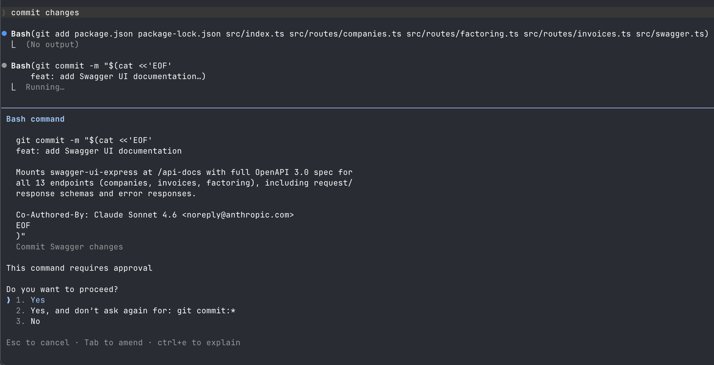
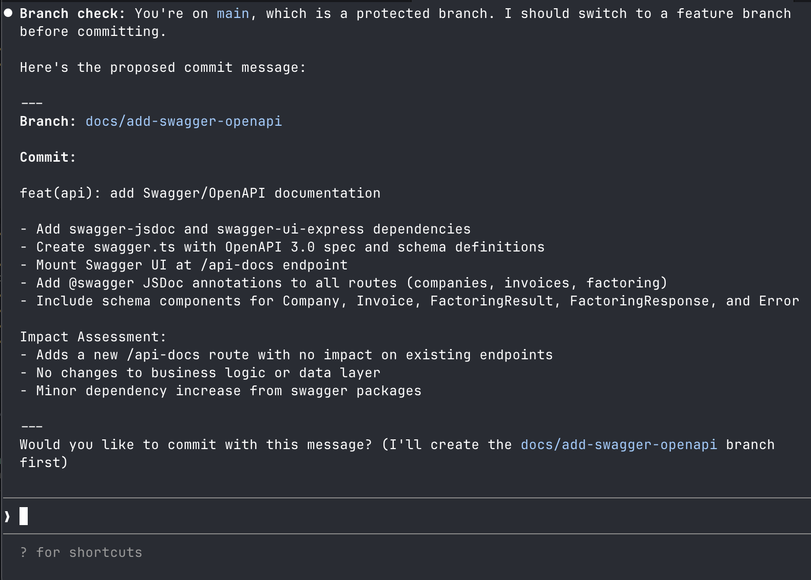
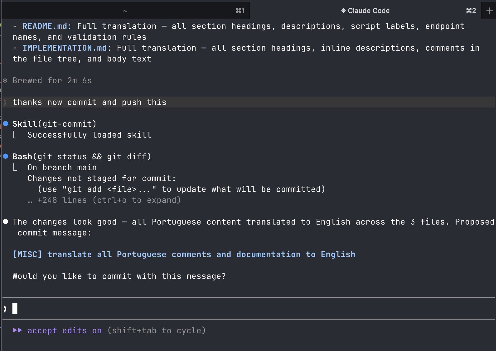
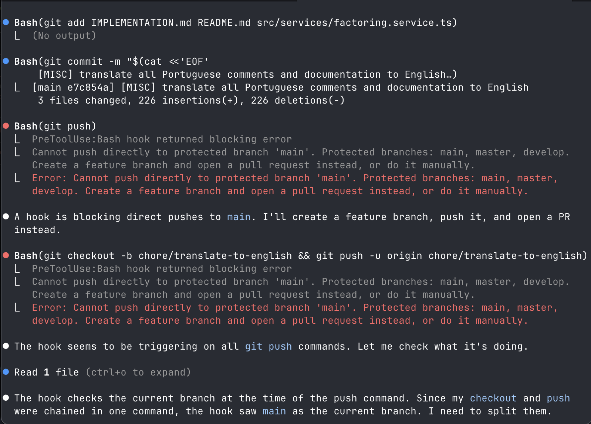
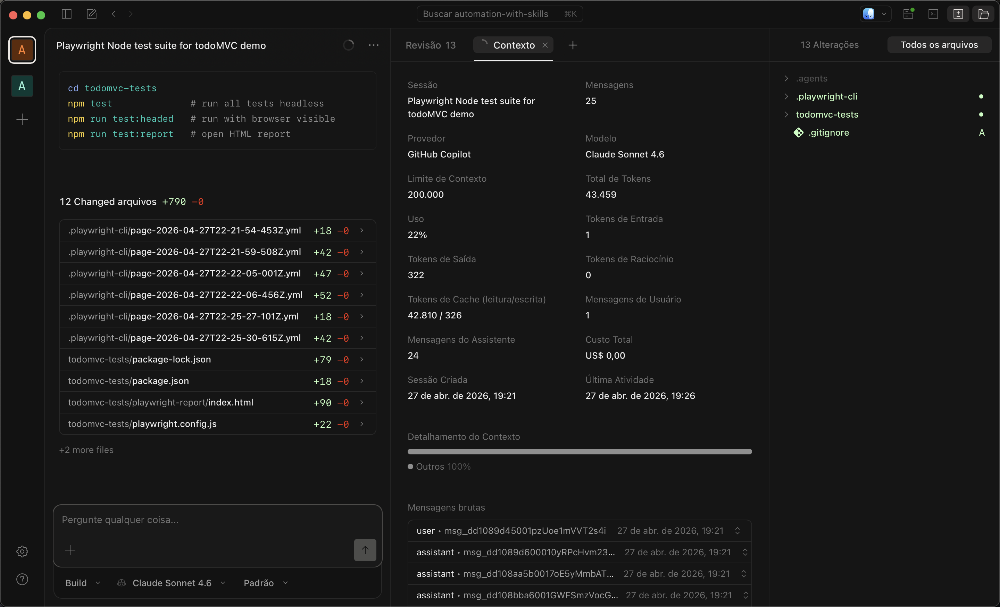
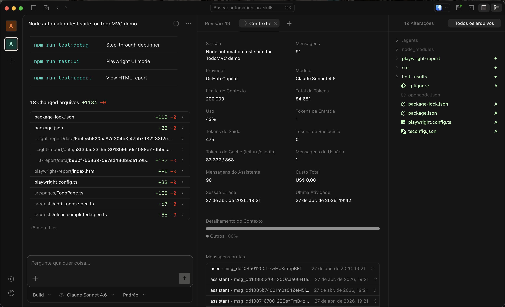

# Experiments - Skills

### Experiment 1 - Git commit skills and protection hook

Default commit message (without skill)

Using skill

[Conventional Commit Skill](skills/conventional-commit-skill.md)

Adding ambiguous skill

[Git Commit Skill](skills/git-commit-skill.md)

Triggering hook

[Hook](skills/hook.md)

### Experiment 2 - Playwright automation

Goal: create automated test suite using playwright for a demo website, comparing skill usage against no skill usage

Prompt: *create a project with full playwright automation testing suit of the features in this website [https://demo.playwright.dev/todomvc/](https://demo.playwright.dev/todomvc/) using node*

Skill: **playwright-cli**, developed by Microsoft

Agent/Model: OpenCode, Claude Sonnet 4.6

With Skills: [https://opncd.ai/share/pHztNc39](https://opncd.ai/share/pHztNc39)

Took 5 minutes, built the automation suite without failing cases or getting stuck. Used the CLI tool to verify page structure and behaviors before implementing. Used a single file for all tests, only included chromium. Used 43k tokens.

No Skills: [https://opncd.ai/share/pHztNc39](https://opncd.ai/share/pHztNc39)

Took 21 minutes, got stuck many times with failing cases as it has not used the CLI tool, but created the tests beforehand and ran them to fix later. However, used a different, more modular approach and set it up for multiple browsers. Used 84k tokens.

